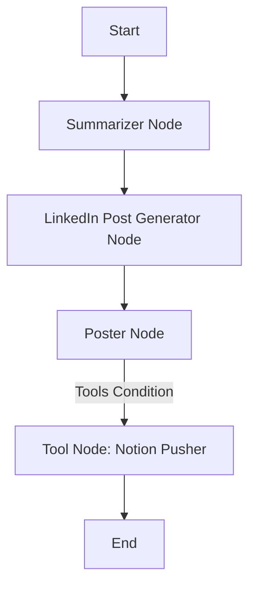

# 🧠 Agentic AI Code Summarizer

A **LangGraph-powered agentic system** that automates the end-to-end process of summarizing code files, generating executive-level insights, creating a LinkedIn post, and posting it to Notion — all through intelligent, tool-augmented LLM agents.

---

## 🚀 Overview

This project is designed for developers, teams, and technical writers who want to extract quick yet insightful summaries from codebases, complete with:

* 📄 **Developer-Focused Summary**
* 🧑‍💼 **Executive-Level Summary**
* 🧰 **Tech Stack Extraction**
* ✍️ **Auto-generated LinkedIn Post**
* 🗃️ **Push-to-Notion Integration**

Built using **LangGraph**'s agentic workflow capabilities, this project simulates an autonomous agent loop that can reason, invoke tools, and resume interrupted tasks — making it **production-ready and highly modular**.

---

## 🔍 Features

* **File Upload Interface** via Streamlit
* **LangGraph Workflow** with checkpointing and interruption/resume handling
* **Recursive Code Chunk Summarization** using Google Gemini 2.0 Flash
* **Developer Summary Generation** with function-level explanations and import analysis
* **Executive Summary Generation** for non-technical audiences
* **Tech Stack Identification** from parsed code context
* **LinkedIn Post Creation** with professional tone and formatted spacing
* **Auto Tool Invocation** to push post content to Notion using Notion API
* **Session-Aware Agent Execution** with thread context tracking

---

## 🏗️ Architecture



Each node is a discrete agentic step managed by **LangGraph**, ensuring:

* Logical sequencing
* Resumability (via `Command(resume=...)`)
* Scalable, modular workflows

---

## ⚙️ Tech Stack

* **Python**
* **Streamlit** – UI layer for user interaction
* **LangGraph** – Agentic orchestration and state management
* **Google Gemini Flash 2.0** – LLM for summarization and reasoning
* **Notion API** – Push summarized content to Notion workspace
* **LangChain Tools** – Tool registration and binding
* **MemorySaver** – In-memory checkpointing

---

## 📁 Folder Structure

```
.
├── main.py             # LangGraph setup and tool logic
├── app.py              # Streamlit frontend
├── .env                # API keys
├── requirements.txt    # Dependencies
└── README.md           # This file
```

---

## 🧠 Agentic Flow

Each phase of this pipeline is handled as a **stateful LangGraph node**, enabling:

1. Persistent memory of prior summaries
2. Intelligent reasoning between LLM generations
3. Seamless interruption handling for user feedback (e.g., editing posts)
4. Automatic resume and action based on input

---

## 🧪 Use Cases

* 🔍 Quick understanding of open-source or legacy code
* 📊 Executive reporting for engineering managers
* ✍️ Auto-generation of project descriptions for documentation or social sharing
* 🧠 Demonstration of Agentic AI architectures in practice

---

## 📦 Setup Instructions

```bash
git clone https://github.com/your-username/agentic-code-summarizer.git
cd agentic-code-summarizer
pip install -r requirements.txt
touch .env  # Add your NOTION_API_KEY
streamlit run app.py
```

---

## 🛡️ Security & Privacy

* All files are processed locally and temporarily stored.
* API keys are secured via environment variables.
* No data is sent or stored outside the intended APIs.

---

## 🤝 Contributing

Want to improve the summarization logic, add more tools, or connect new APIs?
Pull requests are welcome! Please follow conventional Git practices.

---

## 📬 Contact

If you're a recruiter, developer, or research team interested in agentic AI systems or looking for a collaborator, feel free to connect:

[LinkedIn](https://www.linkedin.com/in/bibek-barik/) •

---

